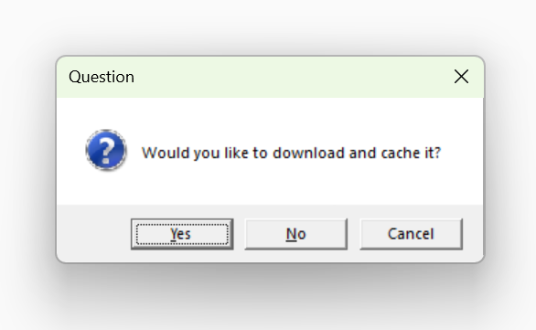
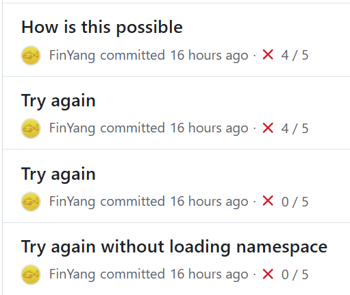
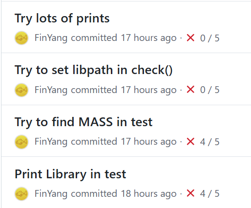

```{r}
#| label: setup
#| echo: false

library(tidyverse)

theme_set(theme(
  plot.background = element_blank(),
  legend.background = element_blank(),
  text = element_text(size = 21)
))

cbf_palette_grey <- c(
  "#D55E00",
  "#0072B2",
  "#009E73",
  "#CC79A7",
  "#E69F00",
  "#56B4E9",
  "#F0E442",
  "#999999"
)

options(ggplot2.discrete.fill = cbf_palette_grey)
options(ggplot2.discrete.colour = cbf_palette_grey)

```


## Data in R


```{r}
#| eval: true
library(tsibble)
tourism
```

## R package 

:::: {.columns}

::: {.column width="50%"}

### Source package

```
tsibble/
├── DESCRIPTION
├── NAMESPACE
├── R/
├── data/
│   └── tourism.rda
├── data-raw/
│   ├── tourism_raw.csv
│   └── get_tourism.R
└── man/
```
:::
::: {.column width="50%"}

### Binary package

```
tsibble/
├── DESCRIPTION
├── NAMESPACE
├── INDEX
├── Meta/
├── R/
├── help/
└── data/
    ├── Rdata.rdb
    ├── Rdata.rds
    └── Rdata.rdx

```

:::
::::

## Distribution

### The Comprehensive R Archive Network (CRAN)


```{r}
install.packages("tsibble")
```

```{r}
#| echo: false
#| eval: true
#| cache: true

n_pkg <- try(nrow(available.packages(contrib.url(
  "https://cran.rstudio.com/",
  "both"
))))
if (inherits(n_pkg, "try-error") || n_pkg < 23424) {
  n_pkg <- 23424
}

```

- Precompiled (binary) distribution of contributed packages.
- Currently hosts `r n_pkg` packages.


### Github and alike

```{r}
remotes::install_github("FinYang/roam")
```

- Compiled locally from source.


## Getting help

```{r}
?tourism
```

```{r}
#| echo: false
#| output: asis
#| eval: true
# get_help <- function(...) {
#   helpfile <- utils:::.getHelpFile(help(...))
#   on.exit(unlink(helpfile))
#   outfile <- tempfile(fileext = ".html")
#   tools:::Rd2txt(helpfile, out = outfile, outputEncoding = "UTF-8")
#   raw_file <- paste(readLines(outfile), collapse = "\n")
#   raw_file
# }
# cat(get_help(tourism))
library(printr)
help(tourism)
detach('package:printr', unload = TRUE)
```

## List of data

```{r}
data()
```

```{r}
#| echo: false
#| eval: true
library(printr)
data()
detach('package:printr', unload = TRUE)
```


## List of data in a package

```{r}
data(package = "tsibble")
```

```{r}
#| echo: false
#| eval: true
library(printr)
data(package = "tsibble")
detach('package:printr', unload = TRUE)
```

## Limitations

:::: {.columns}

::: {.column width="40%"}

### Source package

```
tsibble/
├── DESCRIPTION
├── NAMESPACE
├── R/
├── data/
│   └── tourism.rda
├── data-raw/
│   ├── tourism_raw.csv
│   └── get_tourism.R
└── man/
```
:::
::: {.column width="60%"}


- Data included in package

- CRAN size limit 5 MB
    - Including documentation, vignettes, pictures
\pause

- The data are updated only when the package is updated
    - CRAN recommended update frequency "No more than every 1-2 months"

:::
::::

## Data with `roam`

```{r}
#| eval: true
library(roam.demo)
options(roam.autodownload = TRUE)
bee
```


## Help with `roam`


```{r}
?bee
```

```{r}
#| echo: false
#| eval: true
#| output: asis
library(printr)
help(bee, package = "roam.demo")
detach('package:printr', unload = TRUE)
```

## But storage with `roam`?


:::: {.columns}

::: {.column width="50%"}

### Source package

```
roam.demo/
├── DESCRIPTION
├── NAMESPACE
├── R/
└── man/
```
:::
::: {.column width="50%"}

### Binary package

```
roam.demo/
├── DESCRIPTION
├── NAMESPACE
├── INDEX
├── Meta/
├── R/
└── help/
```

:::
::::

\pause

- The data is not combined with the package.

## `roam`: Remote Objects with Active-binding Magic

1. Allow 'regular looking' R objects in packages to exceed the 5MB limit.

2. Support updating of datasets without updating packages by using functions that pull from remote resources.

3. Make it easy for packages to include these 'roaming' datasets.

## Data with `roam`

```{r}
#| eval: true
library(roam.demo)
options(roam.autodownload = TRUE)
bee
```

## Data with `roam`


```{r}
#| eval: false
library(roam.demo)
bee
```

```{r}
#| eval: true
#| echo: false
cat('The roam data object "bee" in package roam.demo does not exist locally')
```

\pause

```{r}
#| eval: true
#| echo: false
#| out-width: "0.65\\linewidth"
#| fig-align: center

```

## Data with `roam`

```{r}
#| eval: true
#| echo: false
cat('Data retrieved')
```

```{r}
#| eval: true
#| echo: false
library(roam.demo)
options(roam.autodownload = TRUE)
bee
```

## Active bindings

```{r}
#| eval: true
#| echo: false
set.seed(2222)
```

:::: {.columns}

::: {.column width="50%"}


```{r}
#| eval: true
makeActiveBinding(
  "random_number",
  \() rnorm(1L),
  .GlobalEnv
)

```


:::
::: {.column width="50%"}

```{r}
#| eval: true

random_number
random_number
random_number
```

:::
::::

\vspace{4mm}
\pause

- Re-computed every time they are accessed.


## Evil: Stochastic truth

```{r}
#| eval: true

T

makeActiveBinding(
  "T",
  \() sample(c(TRUE, FALSE), 1, prob = c(0.95, 0.5)),
  .GlobalEnv
)

```


:::: {.columns}

::: {.column width="33%"}


```{r}
#| eval: true
T
```

:::
::: {.column width="33%"}

```{r}
#| eval: true
T
```

:::
::: {.column width="33%"}

```{r}
#| eval: true
T
```

:::
::::


## Evil: Mathematical non-constant

```{r}
#| eval: true

pi

makeActiveBinding(
  "pi",
  \() 3.14 + rnorm(1L, sd = 0.1),
  .GlobalEnv
)

```


:::: {.columns}

::: {.column width="33%"}


```{r}
#| eval: true
pi
```

:::
::: {.column width="33%"}

```{r}
#| eval: true
pi
```

:::
::: {.column width="33%"}

```{r}
#| eval: true
pi
```

:::
::::

## Names

### Who

- __Developer, Pacakge writer__: The people who uses `roam` in their packages to provide data.

- __User__: The people who uses the packages developed by the _developer_ and consumes the data.

\pause

### What

- [`roam`](https://github.com/FinYang/roam): The package that provide the tools.
- [`roam.demo`](https://github.com/FinYang/roam.demo): A demo package that uses `roam` to provide data.


## Developer without roam

:::: {.columns}

::: {.column width="50%"}


```{r}
# data-raw/bee.R
library(readr)
bee <- read_csv(
  "data-raw/bee.csv"
)
usethis::use_data(bee)
```

:::
::: {.column width="50%"}


### Source package

```
roam.demo/
├── DESCRIPTION
├── NAMESPACE
├── R/
├── data/
│   └── bee.rda
├── data-raw/
│   ├── bee.csv
│   └── bee.R
└── man/
```

:::
::::

## Developer with roam 


### Definition

```{r}

obtainer <- function(version) {
  readr::read_csv("path/to/bee.csv")
}
bee <- roam::new_roam('roam.demo', 'bee', obtainer)

```

### Activation

```{r}
.onLoad <- function(libname, pkgname) {
  roam::roam_activate(bee)
}

```

## Two-step process

`roam` objects are regular looking objects that works like functions.


1. __Definition__: Create the function
1. __Activation__: Turn it into a `roam` object.

## 1. Definition 

```{r}
new_roam(package, name, obtainer, ...)
```

- `package`: the name of the package as a string
- `name`: the name of the roam object. It should be the same as the name to which the roam object is assigned.
- `obtainer`: the function the developer defines to retrieve the dataset from the remote source.

## Obtainer

```{r}
obtainer <- function(version) {
  readr::read_csv(
    "https://raw.githubusercontent.com/finyang/roam/master/demo/bee_colonies.csv"
  )
}
```

- `obtainer`: the function the developer defines to retrieve the dataset from the remote source.
- Needs to have (at least) one argument called `version` for versioning purpose.

## Functional programming: Function factory

\begin{block}{Function factory}
A function that makes functions
\end{block}


```{r}
obtainer <- function(version) readr::read_csv("url/to/csv")
bee <- roam::new_roam('roam.demo', 'bee', obtainer)
str(bee)
```

```{r}
#| eval: true
#| echo: false

obtainer <- function(version) {
  readr::read_csv(
    "https://raw.githubusercontent.com/finyang/roam/master/demo/bee_colonies.csv"
  )
}
bee <- roam::new_roam('pkg', 'bee', obtainer)
str(bee)
```

## 2. Activation 

```{r}
.onLoad <- function(libname, pkgname) {
  roam::roam_activate(bee)
}

```

- Active bindings are not preserved during package installation.
- `.onLoad` is called when the package `roam.demo` is loaded
    - `roam_object`s are activated during package loading

## So where is the data?

User-specific data directory

- win: C:/Users/P70~0/AppData/Local/r-roam/r-roam/
- mac: ~/Library/Application Support/r-roam/
- unix: ~/.local/share/r-roam/

```
r-roam/
├── roam.demo/
│   ├── tidytuesday2026Jan.RData
│   ├── tidytuesday2026Jan.txt
│   ├── bee.RData
│   └── bee.txt
...
```

## Challenges

::: {layout-ncol=2}






:::

## Can't reach active bindings

:::: {.columns}

::: {.column width="50%"}


### Features

```{r}
#| eval: true
#| echo: false

rm(bee)
```

\AddToHook{env/Highlighting/begin}{\small}
```{r}
# Install a specific version
roam_install(bee, version = "1.2.1")
# Install the latest version
roam_update(bee)
# Get the current version
roam_version("roam.demo", "bee")
# Delete the local cache
roam_delete(bee)
```

:::
::: {.column width="50%"}

\pause

But the `roam_object` is not accessible after activtation, only the output

\AddToHook{env/Highlighting/begin}{\normalsize}
```{r}
#| eval: true

class(bee)

typeof(bee)

str(bee)
```


:::
::::


## Evaluation order

```{r}
str(bee)
```

It would work if 

```{mermaid}
%%| eval: true
%%| echo: false
%%| fig-width: 5.5
flowchart LR
    A["bee (roam_object)"] --> B("str()") -->|"obtainer()"| C["bee (data)"]

```

But it is actually

```{mermaid}
%%| eval: true
%%| echo: false
%%| fig-width: 5.5
flowchart LR
    D["bee (roam_object)"] -->|"obtainer()"| E["bee (data)"] --> F("str()") 
```

## Solution: flags (something like environment variable)

:::: {.columns}

::: {.column width="50%"}

```{r}
roam_delete(bee)
```

```{r}
# roam_delete
{
  roam_flag$delete <- TRUE
  bee
  roam_flag$delete <- FALSE
}
```

:::

::: {.column width="50%"}

```{r}
# bee
{
  if (roam_flag$delete) {
    # delete cache
  }
  if (roam_flag$update) {
    # update bee
  }
  ...
}
```

:::
::::

## Versioning

- Cannot input or output version to or from `roam_object`
    - The only output should be the data itself.
    - Should not modify the data from `roam`
    - Cannot attach version info to the data
\pause
- User supply version and developer version are not the same
    - User says `latest` while developer says `2026-03-26`.
    - Developer should have control.

## Internals

```{r}
roam_install(bee, version = "latest")
```

:::: {.columns}


::: {.column width="55%"}

```{r}
# roam_install
roam_flag$install <- TRUE
roam_flag$version <- "latest"
bee
roam_flag$install <- FALSE
roam_flag$version <- NA
```

:::

::: {.column width="45%"}

```{r}
# bee
if (roam_flag$install) {
  obtainer(
    roam_flag$version
  )
}
```

:::
::::

## Developer has control

```{r}
obtainer <- function(version) {
  if (version == "latest") {
    developer_version <- "0.1.0"
  }

  # Tell roam what is the version to remember
  roam_set_version(developer_version)

  # Specify how to download based on version
  return(download_with(version = version))
}
```

## Remember version

```
r-roam/
├── roam.demo/
│   ├── tidytuesday2026Jan.RData
│   ├── tidytuesday2026Jan.txt
│   ├── bee.RData
│   └── bee.txt
...
```

- The version is stored in a separate `.txt` file in the same folder as the data.
- `roam` never touches the data provided by the developer.


## Coauthor


:::: {.columns}

::: {.column width="50%"}

:::

::: {.column width="50%"}

__Mitchell O'Hara-Wild__

\vspace{2mm}

PhD candidate at Monash University; Consultant at Nectric. Data scientist and developer of statistical software.

\vspace{3mm}
\href{https://mitchelloharawild.com/}{\faIcon{home}  mitchelloharawild.com}

<!-- Packages: 
`ggtime` [cre], `distributional` [cre], `fable` [cre], `feasts` [cre], `vitae` and `forecast` [aut], among others -->


\vspace{3mm}

Will be visiting us on 18–19 June


:::

::::

## Contact


:::: {.columns}

::: {.column width="50%"}

:::

::: {.column width="50%"}
\textbf{Slides}: 
\href{https://yangzhuoranyang.com/talk/roam-dad/}{yangzhuoranyang.com/ talk/roam-dad}

\vspace{2mm}
\textbf{roam}: \href{https://github.com/FinYang/roam}{github.com/FinYang/roam}

\vspace{2mm}
\href{https://yangzhuoranyang.com}{\faIcon{home}  yangzhuoranyang.com}

\vspace{2mm}

\href{mailto:yangzhuoran.yang@maastrichtuniversity.nl}{\faIcon{envelope} yangzhuoran.yang @maastrichtuniversity.nl}

:::
::::

<!-- 

use txt file for version

## mermaid


## Unit test?

evaluated too many times?

# Hacks?
 -->
